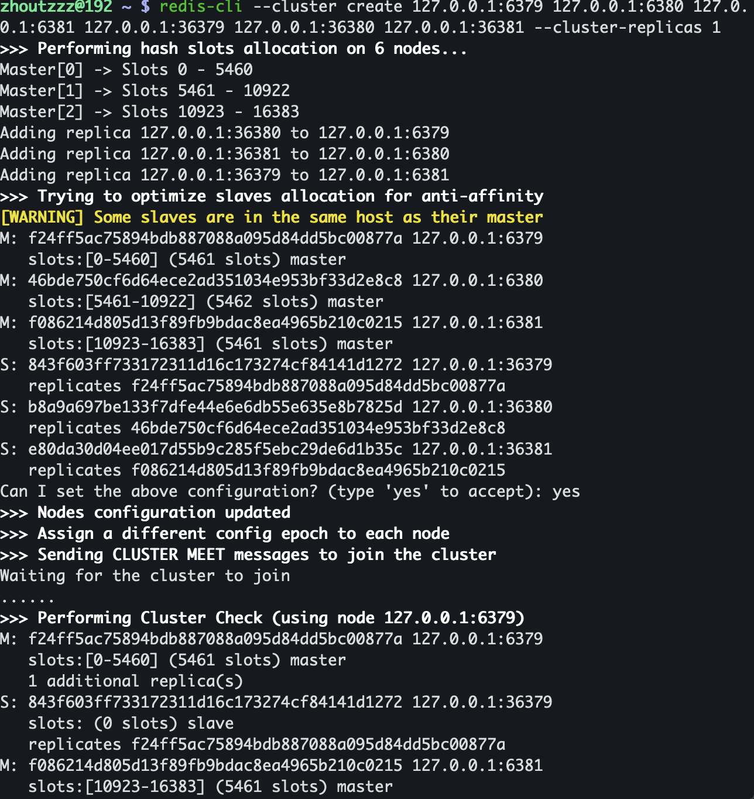
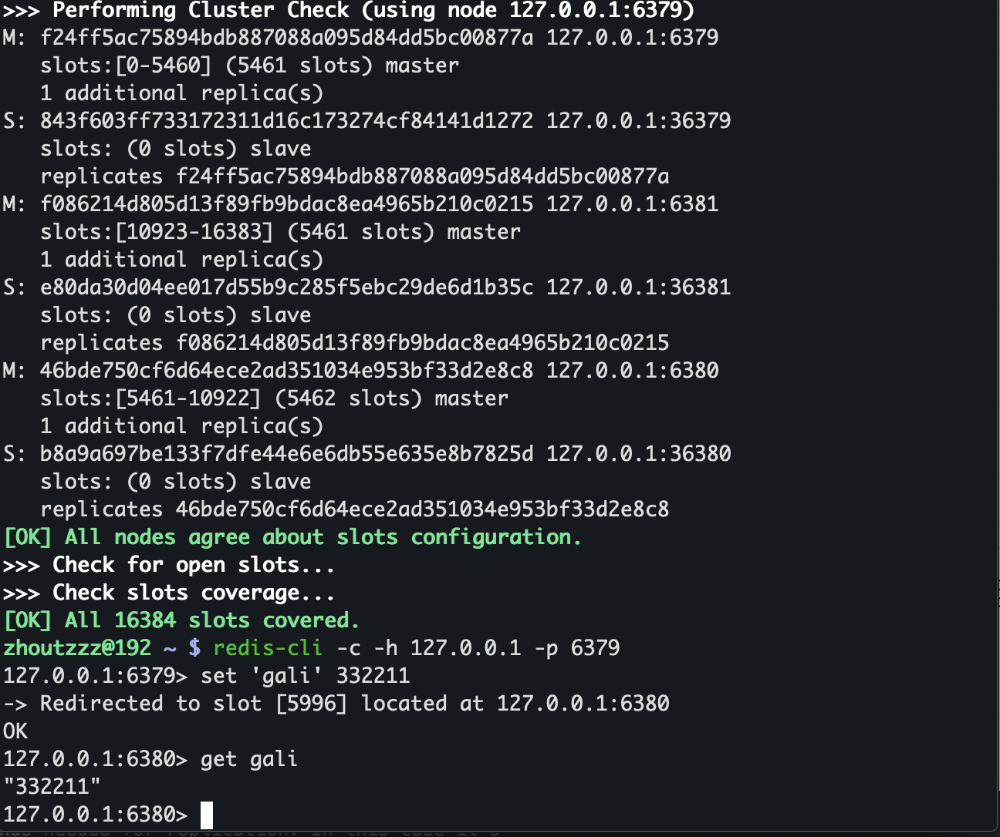

# redis-cluster
启动6个单独的redis实例，每个redis实例修改端口号、打开集群：
```
    port 36379

    // 开启集群
    cluster-enabled yes

    //指定此redis实例启动时生成的集群文件名称，每个实例对应一个唯一的集群文件名称
    cluster-config-file nodes-36379.conf

```

执行创建集群命令：
```
redis-cli --cluster create 127.0.0.1:6379 127.0.0.1:6380 127.0.0.1:6381 127.0.0.1:36379 127.0.0.1:36380 127.0.0.1:36381 --cluster-replicas 1
```

--cluster-replicas 1表示集群下每个主库下有一个从库，redis集群最少需要3个master节点，每个节点最少需要一个slave，所以一个最小规模的redis集群最少需要6个单独的redis实例。

得到如下的日志，提示是否使用系统推荐的方式配置集群，选择no则自己手动配置。


最后集群搭建完成，输入如下命令连接到集群中：
```
redis-cli -c -h 127.0.0.1 -p 6379
```
添加一个数据，日志信息提示该数据被分配到6380节点，自动跳转到6380并在6380 get key得到数据，配置完成。



## 一些集群的注意点

配置redis-cluster，节点需要是单独节点，不能有主从关系，否则会报错 slaveof directive not allowed in cluster mode，相反，如果有主从关系，则这两个节点不能加入到集群，除非解除主从关系。

集群中的每个节点，只能对应一个cluster-config-file配置对应的文件，不能冲突。