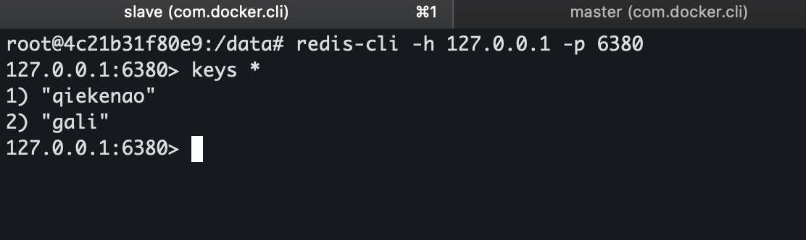
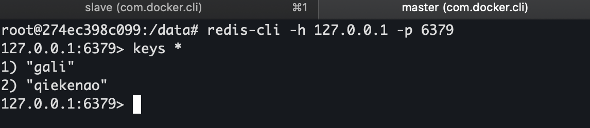
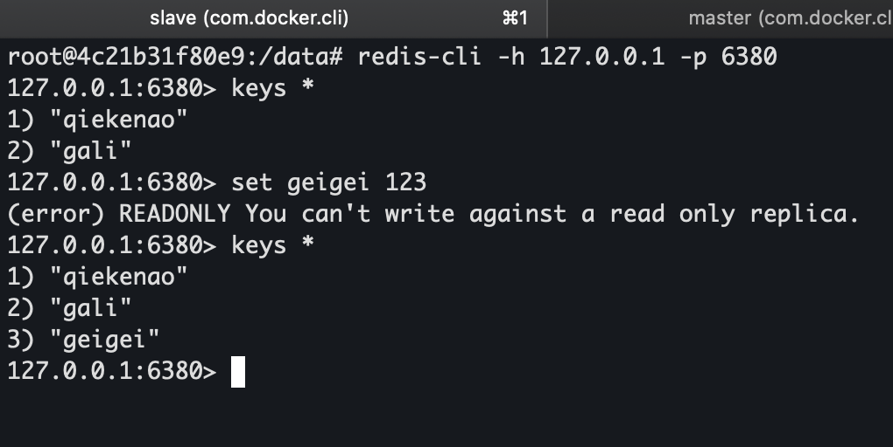
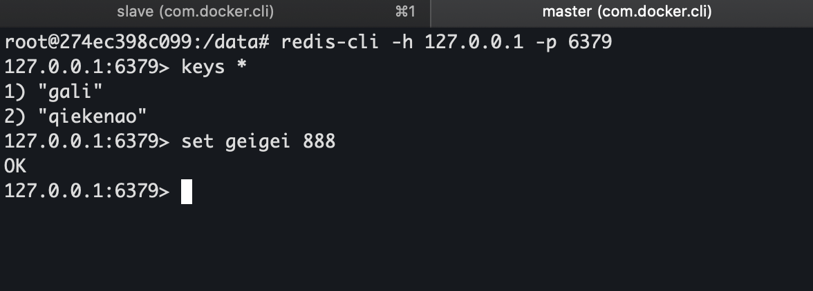

# redis主从复制
分别使用redis6379.conf、redis6380.conf启动两个redis-server，6379为主，6380为从。
主库配置为默认配置，从库核心配置如下：
```
    bind 127.0.0.1

protected-mode yes
port 6380
tcp-backlog 511

timeout 0

tcp-keepalive 300

daemonize no

supervised no

pidfile /var/run/redis_6379.pid
loglevel notice

logfile ""
databases 16

save 900 1
save 300 10
save 60 10000
stop-writes-on-bgsave-error yes

rdbcompression yes

rdbchecksum yes


dbfilename dump.rdb

rdb-del-sync-files no

dir ./

replicaof 192.168.1.2 6379
...
```

replicaof指定为宿主机ip，docker中指定为127.0.0.1会连接失败。

可以看到主库和从库的数据都是一样的。



往从库写，出现报错，说明主从配置有效，这时候往主库写一个值，从库也同步到了。


